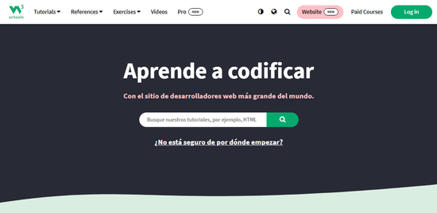
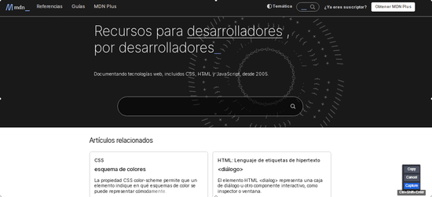
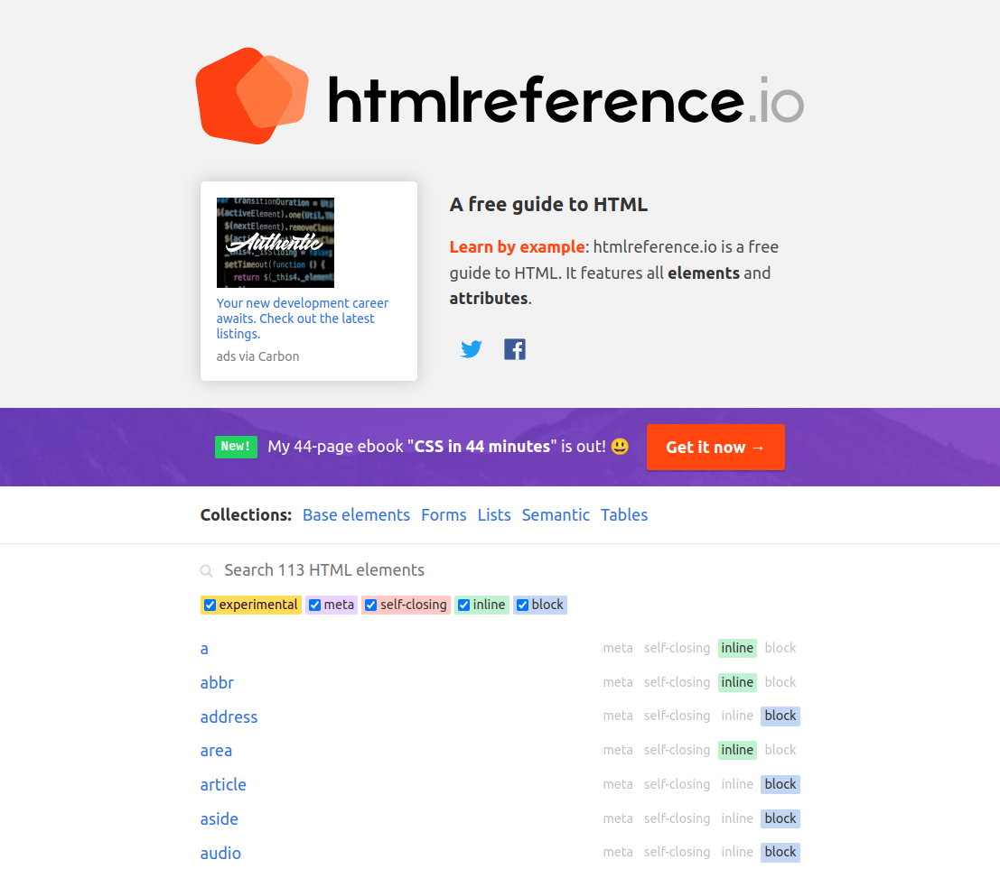

# Paginas web para aprender html

Para dedicarte al desarrollo web sin duda unas de las primeros recursos que  uno tiene que aprender es html, que es el encargado de darle estructura a nuestras paginas web,¿ Que es html?<!--truncate--> 

HTML sus siglas en inglés de **HyperText Markup Language** (lenguaje de marcado de hipertexto), hace referencia al lenguaje de marcado  para la elaboración de páginas web , es el encargado de presentar los datos en nuestra web es a continuacion dejo algunas paginas donde podemos podemos profundizar en el aprendizaje conocer los diferentes etiquetas y propiedades:

- 1 <a href="https://www.w3schools.com/html/default.asp" >w3school</a>: Es un sitio web para aprender tecnologías web .  Contiene tutoriales ademas de HTML, de CSS, JavaScript, SQL, PHP ymucho mas.

- 2 <a href="https://developer.mozilla.org/es/docs/Web/HTML" >MDN Web Docs</a>:  es el sitio web oficial de Mozilla para la documentación de estándares web aloja muchos documentos sobre diferentestes tecnologías web,como HTML5, JavaScript, CSS, y mucho mas, exelente si quieres profundizar en html.

- 3 <a href="https://html-css-js.com/html/tags/#base" >html-css-js.com</a>:  Cheetseet de tags de html, exelente para consultar cuando olvidas como usar los tags, te muestra una lista con ejemplos de como implimentarlos.

