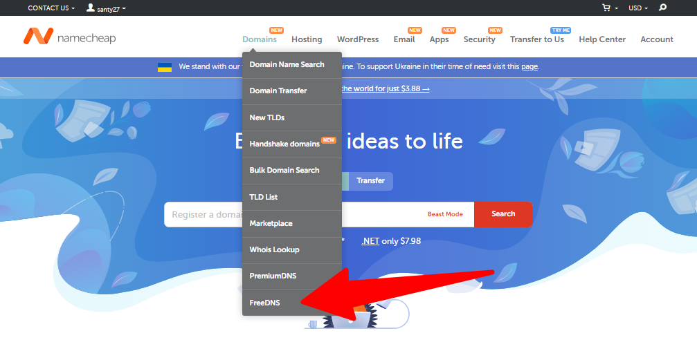
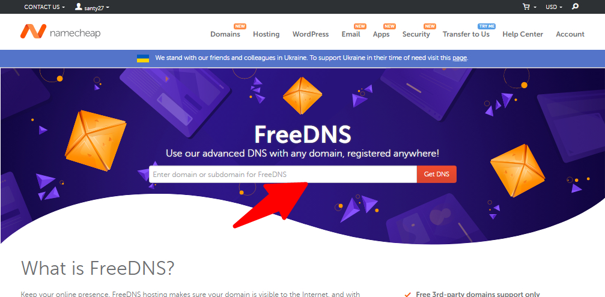
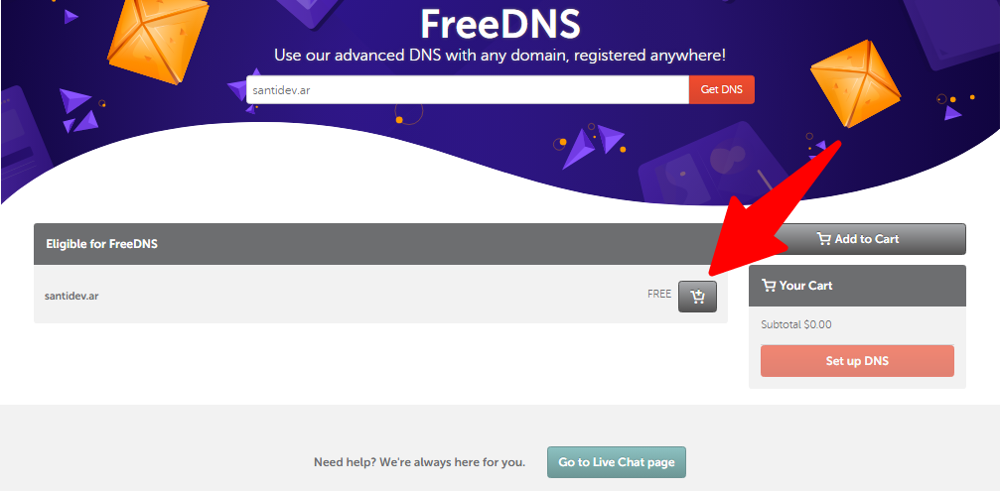
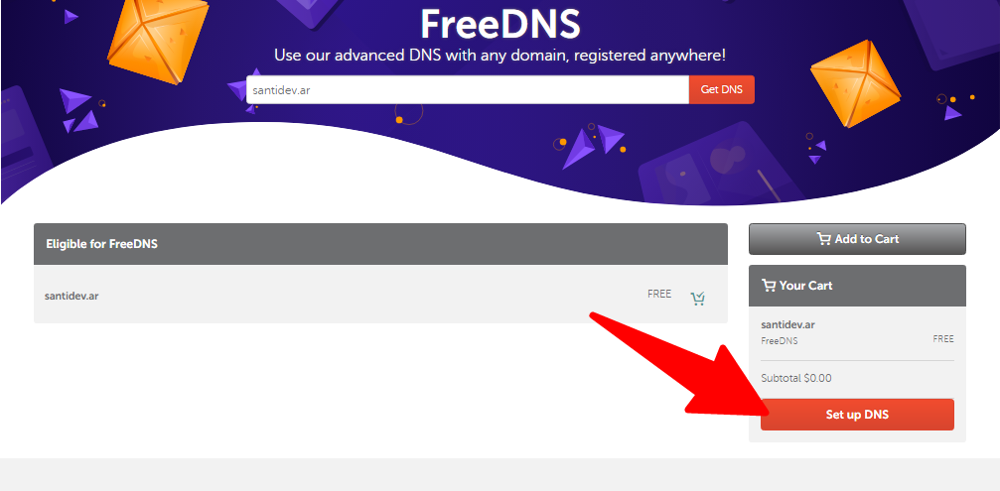
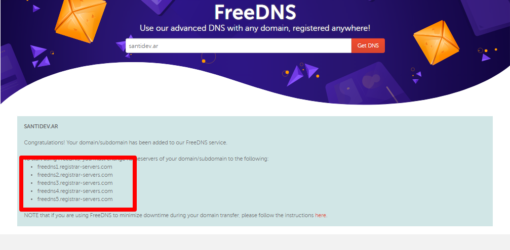
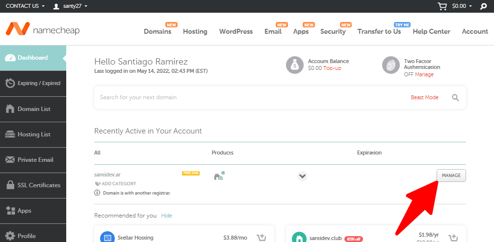
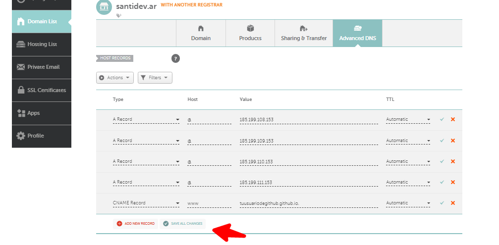
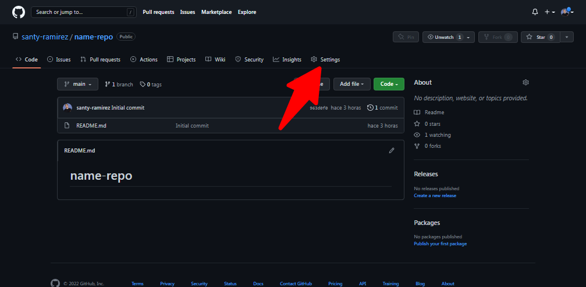
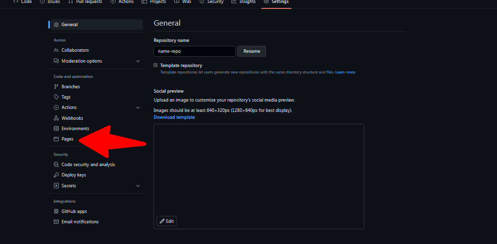
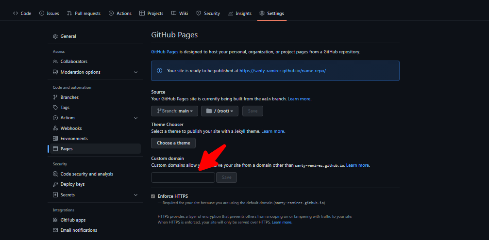

# Dominio personalizado con nic.ar -github pages

En esta ocasión vamos a vincular un dominio personalizado con la extension “.com.ar”. 
Primero tenemos que comprar un dominio en [nic.ar](http://nic.ar), teniendo una clave fiscal nivel 2 o superior y CUIL, <!--truncate-->no tenes  clave fiscal [visitar enlace para conocer como generar  clave](https://www.afip.gob.ar/claveFiscal/recuperar-clave/nivel-3.asp), para conocer como registrar un dominio visita el instructivo de [nic.ar](https://nic.ar/es/ayuda/instructivos/registro-de-dominio)  ,   una ves que tengamos  el dominio hace falta un servicio de DNS que nos servirá para vincular los servidores de github con nuestro dominio.

En este caso vamos a utilizar NameChep, nos creamos una cuenta  [aqu](https://www.namecheap.com/myaccount/signup/)í, una ves que nos creamos una cuenta iniciamos sesión y nos vamos a freeDNS y colocamos nuestro dominio que acabamos de registrar en [nic.ar](http://nic.ar) 



Una vez copiado nuestro dominio en el input le damos click en get DNS



 Click en add cart, tranquilos no vamos a pagar nada es free, ya que es nuestro dominio acuérdense que ya compramos en nic.ar.



Una vez agregado a nuestro cart damos click en “set up DNS”.



Nos aparecerá las direcciones DNS que nos servirá para delegar en nic.ar, visita el instructivo de como   [delegar](https://nic.ar/es/ayuda/instructivos/delegacion-de-dominios).A continuación les dejo los DNS si los quieren copiar desde aqui.

```jsx
freedns1.registrar-servers.com
freedns2.registrar-servers.com
freedns3.registrar-servers.com
freedns4.registrar-servers.com
freedns5.registrar-servers.com
```



Una vez delegado  volvemos a Namechep,iniciamos sesión y en nuestro Deshboard vamos ver nuestro dominio, damos click en “manage”.



Nos vamos a advance DNS, y nos aseguramos de configurar de la siguiente manera. Click save all change, para guardar todos los cambios.




Una ves hecho esto nos vamos al repositorio de nuestro github a seting.



A pages.



Colocamos la rama en la cual esta nuestro proyecto,se recomienda que la rama se llame gh-pages, una vez seleccionado le damos save y nos aparecerá para vincular nuestro dominio personalizado.Una ves colocado nuestro dominio personalizado,click  save.



Felicitaciones Si seguiste todos los pasos anteriores deberías ver tu sitio en el dominio personalizado.Si no ves reflejado tu sitio, tranquilo, puede tardar hasta 24 horas para que se vean reflejados los cambios. 

