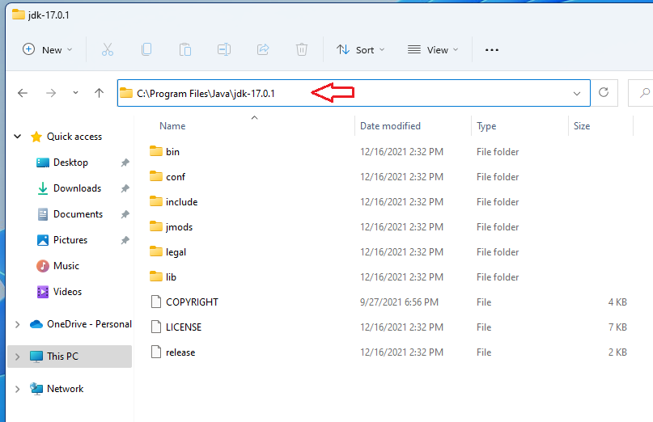
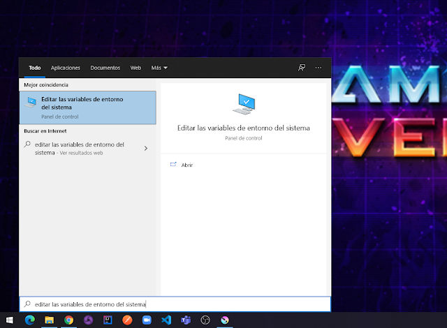
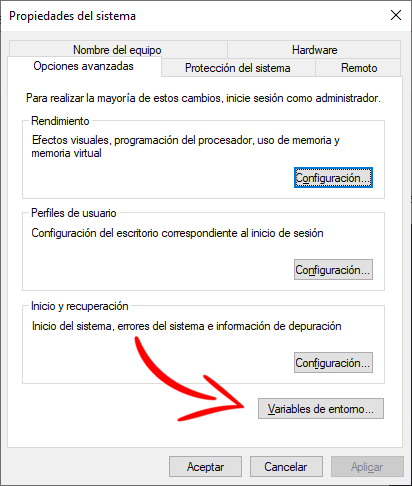
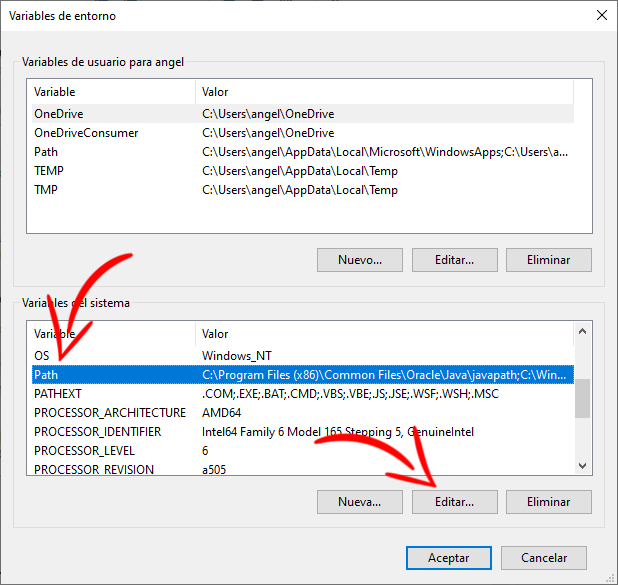
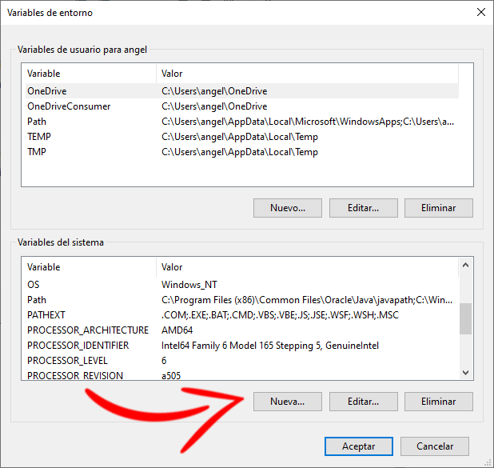

# Desarrollo en Java:Visual Studio Code en Windows y Linux

import Tabs from "@theme/Tabs";
import TabItem from "@theme/TabItem";

En este post, te guiaré a través del proceso de configuración de Visual Studio Code (también conocido como VSCode) para programar en Java con funciones como autocompletado de código, importación de librerías y autoformato de código, entre otras utilidades. En resumen, aprenderás a establecer un entorno de programación Java eficiente y sencillo en VSCode.

Vamos a ver cómo crear el "Hola Mundo" en Java, tanto si estás utilizando un sistema operativo Linux como Windows.

<Tabs>
  <TabItem value="linux" label="Linux" default>

## Intalar JDK en linux

Configurar el JDK (Java Development Kit) en Linux es un paso esencial para poder desarrollar aplicaciones Java en tu sistema. A continuación, te proporciono una guía para configurar el JDK en Linux

<script async src="https://pagead2.googlesyndication.com/pagead/js/adsbygoogle.js?client=ca-pub-8467593326194844"
     crossorigin="anonymous"></script>

<ins class="adsbygoogle"
style={{ display: "block", textAlign: "center" }}
data-ad-layout="in-article"
data-ad-format="fluid"
data-ad-client="ca-pub-8467593326194844"
data-ad-slot="6324259488"></ins>

<script>
     (adsbygoogle = window.adsbygoogle || []).push({});
</script>

### Paso 1: Verificar si el JDK está instalado

Antes de instalar el JDK, es importante verificar si ya está instalado en tu sistema. Abre una terminal y ejecuta el siguiente comando para verificar si Java está instalado:

```
java -version
```

Si el JDK ya está instalado, deberías ver la versión de Java que está en tu sistema.

### Paso 2: Instalar el JDK en Linux

Si Java no está instalado o necesitas una versión específica, sigue estos pasos:

Actualiza tu lista de paquetes:

```
sudo apt update
```

Instala el JDK:
Puedes instalar OpenJDK, que es una implementación de código abierto del JDK oficial de Oracle:

```
sudo apt install openjdk-11-jdk
```

<script async src="https://pagead2.googlesyndication.com/pagead/js/adsbygoogle.js?client=ca-pub-8467593326194844"
     crossorigin="anonymous"></script>

<ins class="adsbygoogle"
style={{ display: "block", textAlign: "center" }}
data-ad-layout="in-article"
data-ad-format="fluid"
data-ad-client="ca-pub-8467593326194844"
data-ad-slot="6324259488"></ins>

<script>
     (adsbygoogle = window.adsbygoogle || []).push({});
</script>

Si deseas instalar una versión específica, puedes cambiar el número después de openjdk- (por ejemplo, openjdk-8-jdk).

### Paso 3: Verificar la instalación del JDK

Para asegurarte de que el JDK se haya instalado correctamente, puedes verificar la versión de Java y el compilador Java:

```
java -version
javac -version
```

Ambos comandos deberían mostrar la versión del JDK que has instalado.

### Paso 4: Configurar las variables de entorno

Para que tu sistema pueda encontrar el JDK, es importante configurar las variables de entorno. Abre el archivo` ~/.bashrc` o `~/.bash_profile` (dependiendo de tu distribución) con un editor de texto y añade las siguientes líneas al final del archivo:

```
export JAVA_HOME=/usr/lib/jvm/java-11-openjdk-amd64 # La ruta puede variar dependiendo de tu instalación.
export PATH=$PATH:$JAVA_HOME/bin
```

Guarda el archivo y ejecuta source ~/.bashrc (o source ~/.bash_profile) para aplicar los cambios en la sesión actual de la terminal.

### Paso 5: Verificar la configuración

Finalmente, verifica si la configuración se realizó correctamente:

```

echo $JAVA_HOME

```

Deberías ver la ruta del JDK que configuraste.

¡Listo! Ahora has configurado el JDK en tu sistema Linux. Puedes comenzar a desarrollar aplicaciones Java en tu entorno de preferencia, ya sea con Visual Studio Code, IntelliJ u otro IDE.

<script>
     (adsbygoogle = window.adsbygoogle || []).push({});
</script>

</TabItem>
<TabItem value="windows" label="Windows">

## Instalar JDK en windows

### Paso 1: Descargar e Instalar el JDK

Ve al sitio web de [Oracle JDK](https://www.oracle.com/java/technologies/downloads/) o [OpenJDK](https://jdk.java.net/) y descarga la última versión del JDK.

Ejecuta el instalador y sigue los pasos para instalar el JDK en tu sistema. Asegúrate de recordar la ruta de instalación, ya que la necesitarás más adelante.Por ejemplo yo lo guarde en:


### Paso 2: Configurar las Variables de Entorno

Busca "Variables de entorno" en el menú de inicio y selecciona "Editar las variables de entorno del sistema".



En la ventana de "Propiedades del sistema", haz clic en el botón "Variables de entorno".



En la sección "Variables del sistema", selecciona la variable Path y haz clic en "Editar".

Haz clic en "Nuevo" y agrega la ruta al directorio bin de tu instalación del JDK. Por ejemplo, si instalaste el JDK en `C:\Program Files\Java\jdk-17.0.1`, añade` C:\Program Files\Java\jdk-17.0.1\bin`.



Ahora, crea una nueva variable de entorno llamada `JAVA_HOME` y establece su valor como la ruta a tu instalación del JDK (por ejemplo, `C:\Program Files\Java\jdk-17.0.1)`.



Haz clic en ok y luego en "Aceptar" para cerrar todas las ventanas y guardar todas las configuraciones que hiciste.

### Paso 3: Verificar la Instalación

Para verificar si el JDK se ha instalado correctamente, abre una nueva ventana del símbolo del sistema y ejecuta los siguientes comandos:

```
java -version
```

Deberías ver la versión de Java que instalaste.

```
javac -version
```

Esto debería mostrar la versión del compilador Java.

### Paso 4: Configurar un Entorno de Desarrollo

Ahora que has configurado el JDK, puedes usar un IDE como Visual Studio Code para comenzar a desarrollar aplicaciones Java.

¡Listo! Has configurado el JDK en tu sistema Windows y estás listo para empezar a programar en Java. Si tienes alguna otra pregunta o necesitas más ayuda, no dudes en decírmelo. ¡Buena suerte con tus proyectos!

</TabItem>
</Tabs>
