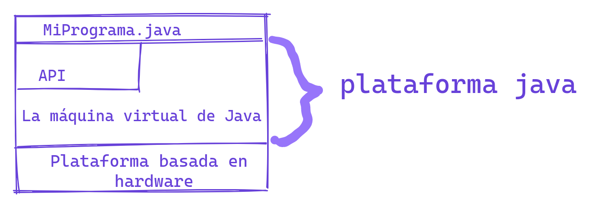

# Sobre Java
## ¿Qué es java?
De java se puede decir que es un lenguaje de programación como así también una plataforma completa.

## Caracteristicas de Java
El lenguaje de programación Java es un lenguaje de alto nivel que puede ser caracterizado por todas las siguientes palabras clave:

- Simple
- Orientado a objetos
- Distribuido
- Multiproceso
- Dinámico
- Arquitectura Neutral
- Portátil
- Alto rendimiento
- Robusto
- Seguro

Cada una de las palabras clave anteriores se explica en[ “The Java Language Environment” ](https://www.oracle.com/java/technologies/language-environment.html), un documento técnico escrito por James Gosling(creador del lenguaje java) y Henry McGilton.

## ¿Como funciona java? 

En el lenguaje de programación Java, todo el código fuente se escribe primero en archivos de texto sin formato que tienen la extensión .java. Luego, esos archivos fuente se compilan en archivos .class mediante el compilador javac. Un archivo .class no contiene código nativo de tu procesador; en su lugar, contiene bytecodes, que son el lenguaje de máquina de la Máquina Virtual de Java (Java VM). Luego, la herramienta de inicio de java ejecuta tu aplicación con una instancia de la Máquina Virtual de Java.


Debido a que la Máquina Virtual de Java está disponible en muchos sistemas operativos diferentes, los mismos archivos .class pueden ejecutarse en Microsoft Windows, el Sistema Operativo Solaris™ (Solaris OS), Linux o Mac OS.

``` java title="/MiPrograma.java"
public class MiPrograma {
    public static void main(String[] args) {
        System.out.println("Hola, mundo!,este es mi programa");
    }
}

```


# La plataforma de java

Una plataforma es el entorno de hardware o software en el que se ejecuta un programa.Algunas de las plataformas más populares son Microsoft Windows, Linux, Solaris OS y Mac OS. La mayoría de las plataformas se pueden describir como una combinación del sistema operativo y el hardware subyacente. La plataforma Java se diferencia de estas, ya  que es una plataforma solo de software que se ejecuta sobre otras plataformas basadas en hardware.

La plataforma Java tiene dos componentes:

- La máquina virtual de Java(VM)
- La interfaz de programación de aplicaciones (API) de Java

La máquina virtual Java(VM); es la base de la plataforma Java y se adapta a  plataformas basadas en hardware(Windows, Linux, Solaris OS y Mac OS).

La API es una gran colección de componentes de software listos para usar que brindan muchas capacidades útiles. Está agrupado en bibliotecas(o librerias) de clases e interfaces relacionadas; estas bibliotecas se conocen como paquetes.
